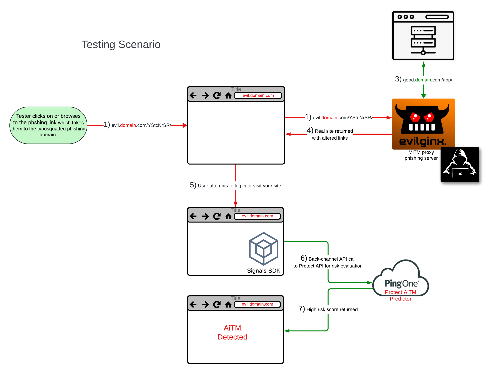

# Evilginx for Testing Your App

Validating the results of the PingOne Protect AiTM Predictor

**_As with any pen testing tool, without proper authorization, a penetration tester is considered to be engaging in unethical hacking. It's illegal to test a website or app for a vulnerability without the owner's permission._** [Disclaimer](#disclaimer)

## This project

Includes config files, a Dockerfile, and instructions for building an instance of an Evilginx phishing proxy server to test your app or website is being protected by the PingOne Protect AiTM predictor.

_Tl;dr, I understand MiTM attacks and know what Evilginx is. Just take me to the instructions._

- [How-to](#how-to)

_I want to understand more about this first. Take me to the reference docs._

- [Docs & Resources](#helpMeObiWon)

## AITM Reference

- [What is Adversary-in-the-Middle, and How Does It Bypass MFA?](https://www.pingidentity.com/en/resources/blog/post/adversary-middle-attacks.html#What-is-Adversary-in-the-Middle-and-How-Does-It-Bypass-MFA)
- [What Man-in-the-Middle Attacks Are and How to Prevent Them](https://www.pingidentity.com/en/resources/cybersecurity-fundamentals/threats/man-in-the-middle-attack.html)
- [Threat Protection using PingOne Protect](https://docs.pingidentity.com/r/en-us/pingone/pingone_p1risk_start)

## Project Details

This project is to help developers test PingOne Protect's AiTM predictor in a policy. Evilginx can be tedious to build and configure. Since we already went through the effort to build an easy-to-deploy Docker version for our own testing, we thought it would be a good thing to templatize and share to speed up your development and testing cycles.

**This is community supported**, so there are plenty of targeted links for Evilginx docs and other useful resources at the bottom.

## Evilginx Details

Evilginx is a man-in-the-middle reverse-proxy attack framework used for phishing account credentials, tokens, and session cookies, which will allow bypassing of multi-factor authentication, identity theft, and ATO (account takeover).

## Testing Scenario

## How-to

### Developer Mode

#### Configuration

**File:** `docker-entrypoint.sh`

- If you have previously removed them, add the `-developer` and `-debug` options to the end of the command. If not, they will already be included by default.

**File:** `config.json`, `evil-phishlet.yaml`

- Update the following values in both files:

  - <phishing_domain>
  - <target_url>
  - <target_domain>
  - <target_sub>

- In evil-phishlet.yaml, update the `auth_token` and `credentials` configs for `path` and `search` settings so Evilginx knows where to capture them.

**File:** `/etc/hosts` (on your local work computer)

- Update your `/etc/hosts` with an entry that matches your phishing domain that resolves to `127.0.0.1`

`EASY BUTTON` _Just the run the following command. Change to your phishing domain, and be sure to include the phish_sub from evil-phishlet.yaml as well._

- `sudo -- sh -c -e "echo '127.0.0.1 <phish_sub>.<phishing_domain>' >> /etc/hosts";`

**Important** Don't forget to comment out any entries you added to `/etc/hosts` before promoting to QA, production or other environments.

Once you're done with all of that, build your dev Docker image with the following...

#### Docker Image Build

Follow your team or company's own Docker image name/tag conventions.

`docker build -f Dockerfile -t <my_image_name>-evilginx:edge .`

**Note:** If you are building your Docker image for a platform/CPU architecture different than your machine, check out,

- [docker buildx --platform](https://docs.docker.com/reference/cli/docker/buildx/build/#platform)

#### Startup

`docker run --rm -it -e TZ=America/Denver -p 443:443 <my_image_name>-evilginx:edge`

#### Test It

**Note:** If you changed your dev phishing domain above for /etc/hosts, be sure to change the following URL accordingly.

Browse to, [https://<phish_sub>.<phishing_domain>/YStcNrSR](https://phishing-domain.com/YStcNrSR)

### Production Mode

#### Configuration

**File:** `docker-entrypoint.sh`

- Remove the `-developer` and `-debug` options at the end of the command.

**File:** `config.json`, `evil-phishlet.yaml`

- Update the hosts and domains and sub configs:
  - Replace target hosts/domains with production host/domain names.
  - Replace the phishing domain with your version of phishing-domain.com.
  - Update the `auth_token` and `credentials` configs for `path` and `search` settings so Evilginx knows where to capture them.

Once you're done with all of that, build your dev Docker image with the following...

#### Docker Image Build

`docker build -f Dockerfile -t <my_image_name>-evilginx:edge .`

**Note:** If you are building your Docker image for a platform/CPU architecture different than your machine, check out,

- [docker buildx --platform](https://docs.docker.com/reference/cli/docker/buildx/build/#platform)

#### Startup

Deploy it to your Docker or k8s (kubernetes) environment, or run it manually with,

`docker run --rm -it -e TZ=America/Denver -p 443:443 <my_image_name>-evilginx:edge`

## Reference Documentation & Useful Resources

### Evilginx Docs

There are multiple links here to different docs because any documentation you find is very sparse and was written like the developer was just documenting for himself.

#### Deep Links

- [Config](https://help.Evilginx.com/docs/guides/config)
- [Phishlet Example](https://help.Evilginx.com/docs/phishlet-format)
- [Phishlets](https://help.Evilginx.com/docs/guides/phishlets)
- [Lures](https://help.Evilginx.com/docs/guides/lures)
- [Blacklist](https://help.evilginx.com/docs/guides/blacklist)
- [Deployment](https://help.evilginx.com/docs/category/deployment)

#### Top-level Links

- [Evilginx.com](https://help.Evilginx.com/docs/category/getting-started)
- [Evilginx Github Project](https://github.com/kgretzky/Evilginx2)
- [Breakdev.org](https://breakdev.org/Evilginx-3-3-go-phish/)
- [Pre-built Phishlets](https://github.com/simplerhacking/Evilginx3-Phishlets)

### Docker Reference

- [Dockerfile](https://docs.docker.com/reference/dockerfile/)
- [ENTRYPOINT](https://docs.docker.com/reference/dockerfile/#entrypoint)
- [Docker Security](https://docs.docker.com/engine/security/)
- [Docker Scout CVES](https://docs.docker.com/reference/cli/docker/scout/cves/)
- [CIS Docker Benchmarks](https://www.cisecurity.org/benchmark/docker)

### PingOne Protect & Developer Resources

- [PingOne Protect](https://apidocs.pingidentity.com/pingone/main/v1/api/#pingone-protect)
- [Protect APIs](https://apidocs.pingidentity.com/pingone/platform/v1/api/#pingone-protect)
- [Protect SDK](https://apidocs.pingidentity.com/pingone/native-sdks/v1/api/#pingone-protect-native-sdks)

# Disclaimer:

I AM AWARE THAT EVILGINX CAN BE USED FOR VERY NEFARIOUS PURPOSES. EVILGINX SHOULD BE USED ONLY IN LEGITIMATE PENETRATION TESTING ASSIGNMENTS WITH WRITTEN PERMISSION FROM TO-BE-PHISHED PARTIES.

THIS TESTING TOOL AND SAMPLE CODE IS PROVIDED "AS IS" AND ANY EXPRESS OR IMPLIED WARRANTIES, INCLUDING THE IMPLIED WARRANTIES OF MERCHANTABILITY AND FITNESS FOR A PARTICULAR PURPOSE ARE DISCLAIMED. IN NO EVENT SHALL PING IDENTITY OR CONTRIBUTORS BE LIABLE FOR ANY DIRECT, INDIRECT, INCIDENTAL, SPECIAL, EXEMPLARY, OR CONSEQUENTIAL DAMAGES (INCLUDING, BUT NOT LIMITED TO, PROCUREMENT OF SUBSTITUTE GOODS OR SERVICES; LOSS OF USE, DATA, OR PROFITS; OR BUSINESS INTERRUPTION) SUSTAINED BY YOU OR A THIRD PARTY, HOWEVER CAUSED AND ON ANY THEORY OF LIABILITY, WHETHER IN CONTRACT, STRICT LIABILITY, OR TORT ARISING IN ANY WAY OUT OF THE USE OF THIS DEMO AND SAMPLE CODE, EVEN IF ADVISED OF THE POSSIBILITY OF SUCH DAMAGE.
